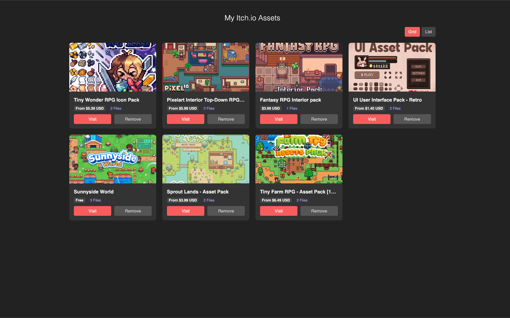
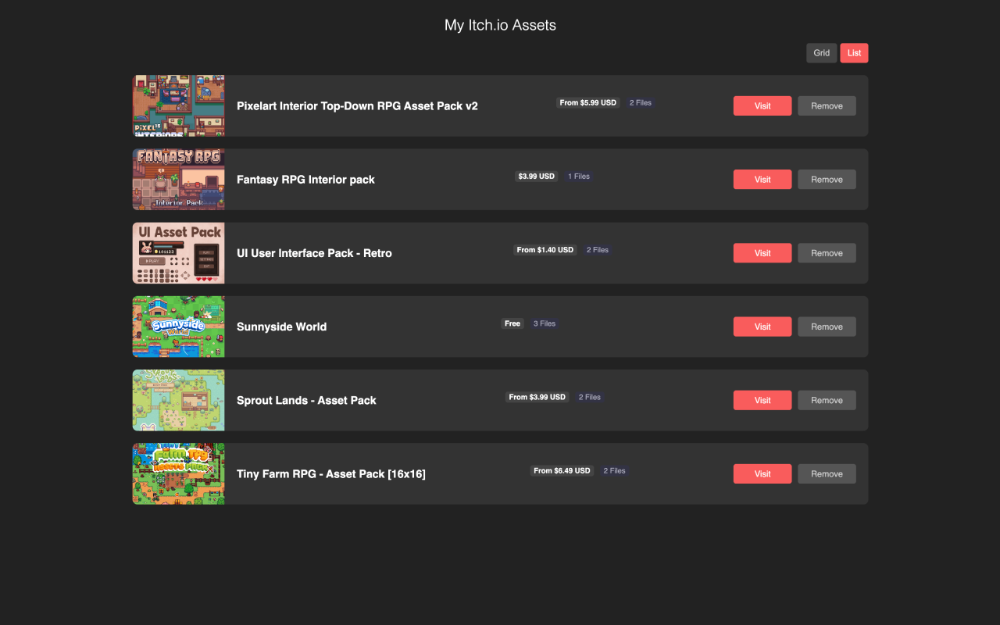

# Itch.io Asset Hoarder

A simple Chrome Extension to keep track of assets you find on itch.io.

Sometimes you find a cool asset pack but don't want to buy it right away, or you have a huge library and want a quick visual reference of specific items. This extension lets you "save" pages into a local library grid.

I had the problem of not having the ability to bulk purchase or favorite some assets, where I want to compare which ones I want to use in my project later on, so I "vibe-coded" an extension and wanted to share with other who are sharing the same problem as me.

## Screenshots

## Features

*   **One-Click Save**: Adds a "Save Asset" button to any itch.io game/asset page.
*   **Smart Scraping**: Automatically grabs the title, cover image, current price (handling sales and "pay what you want"), and file counts.
*   **Visual Library**: View your saved collection in a Grid or List layout.
*   **Privacy First**: All data is stored locally in your browser (`chrome.storage.local`). No external servers, no tracking.

## Installation

Since this isn't on the Chrome Web Store yet, you'll need to load it manually:

1.  Download or clone this repository.
2.  Open Chrome and go to `chrome://extensions`.
3.  Enable **Developer mode** (top right toggle).
4.  Click **Load unpacked**.
5.  Select the folder where you saved this project (`itchio-asset-hoarder`).

## How to Use

1.  **Browse**: Go to any [itch.io](https://itch.io) page.
2.  **Save**: Click the extension icon in your toolbar, then hit **Save Asset**.
3.  **View**: Click **Open Library** to manage your collection. You can toggle between Grid and List views to see prices and file details at a glance.

## License

MIT
